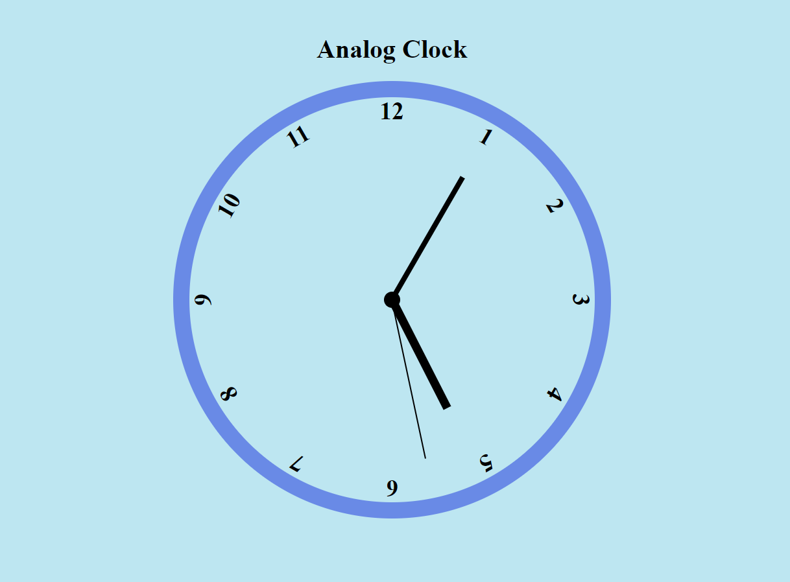

# analog-clock

###  

This is a simple analog clock build usin HTML, CSS and JavaScript.

## Simple Analog clock build using HTML, CSS and JavaScript

# Demo of application   
# [Analog Clock](https://kartavya99.github.io/analog-clock/)

# Features and Techonlogies uses
## JavaScript
## CSS
## HTML 

